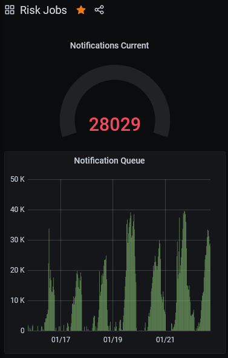
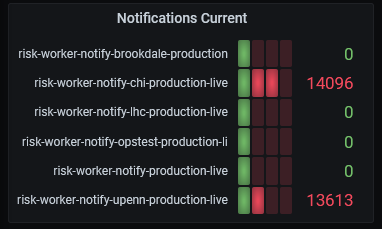

# Healthy/Unhealthy main production cluster report

### Service

**API**
Report from last 7 days on groups of 1 hour

*Healthy Hosts*

[Metric Link](https://us-east-1.console.aws.amazon.com/cloudwatch/home?region=us-east-1#metricsV2:graph=~(metrics~(~(~'AWS*2fApplicationELB~'HealthyHostCount~'TargetGroup~'targetgroup*2fapi-production-live-4512*2fb0d61e807988cad4~'LoadBalancer~'app*2fmain-production-live*2fb2741bcfbe322f5d))~period~3600~region~'us-east-1~stat~'Average~title~'Healthy*20Hosts~yAxis~(left~(min~0))~start~'-P7D~end~'P0D~view~'timeSeries~stacked~false))
 
 
 

*HTTP 5XXs Count*

[Metric Link](https://us-east-1.console.aws.amazon.com/cloudwatch/home?region=us-east-1#metricsV2:graph=~(metrics~(~(~'AWS*2fApplicationELB~'HTTPCode_Target_5XX_Count~'TargetGroup~'targetgroup*2fapi-production-live-4512*2fb0d61e807988cad4~'LoadBalancer~'app*2fmain-production-live*2fb2741bcfbe322f5d))~period~3600~region~'us-east-1~stat~'Sum~title~'HTTP*205XXs~yAxis~(left~(min~0))~start~'-P7D~end~'P0D~view~'timeSeries~stacked~false))
 
 
 

**API V2**
Report from last 7 days on groups of 1 hour

*Healthy Hosts*

[Metric Link](https://us-east-1.console.aws.amazon.com/cloudwatch/home?region=us-east-1#metricsV2:graph=~(metrics~(~(~'AWS*2fApplicationELB~'HealthyHostCount~'TargetGroup~'targetgroup*2fapiv2-production-live-9922*2f33e405eb817c3359~'LoadBalancer~'app*2fservices-production-live*2fa9c3eeee1ac4a15f))~period~3600~region~'us-east-1~stat~'Average~title~'Healthy*20Hosts~yAxis~(left~(min~0))~start~'-P7D~end~'P0D~view~'timeSeries~stacked~false))
 
 
 

*HTTP 5XXs Count*

[Metric Link](https://us-east-1.console.aws.amazon.com/cloudwatch/home?region=us-east-1#metricsV2:graph=~(metrics~(~(~'AWS*2fApplicationELB~'HTTPCode_Target_5XX_Count~'TargetGroup~'targetgroup*2fapiv2-production-live-9922*2f33e405eb817c3359~'LoadBalancer~'app*2fservices-production-live*2fa9c3eeee1ac4a15f))~period~3600~region~'us-east-1~stat~'Sum~title~'HTTP*205XXs~yAxis~(left~(min~0))~start~'-P7D~end~'P0D~view~'timeSeries~stacked~false))
 
 
 

**Admin**
Report from last 7 days on groups of 1 hour

*Healthy Hosts*

[Metric Link](https://us-east-1.console.aws.amazon.com/cloudwatch/home?region=us-east-1#metricsV2:graph=~(metrics~(~(~'AWS*2fApplicationELB~'HealthyHostCount~'TargetGroup~'targetgroup*2fadmin-production-live-5797*2fba714989d8b3a581~'LoadBalancer~'app*2fmain-production-live*2fb2741bcfbe322f5d))~period~3600~region~'us-east-1~stat~'Average~title~'Healthy*20Hosts~yAxis~(left~(min~0))~start~'-P7D~end~'P0D~view~'timeSeries~stacked~false))
 
 
 

*HTTP 5XXs Count*

[Metric Link](https://us-east-1.console.aws.amazon.com/cloudwatch/home?region=us-east-1#metricsV2:graph=~(metrics~(~(~'AWS*2fApplicationELB~'HTTPCode_Target_5XX_Count~'TargetGroup~'targetgroup*2fadmin-production-live-5797*2fba714989d8b3a581~'LoadBalancer~'app*2fmain-production-live*2fb2741bcfbe322f5d))~period~3600~region~'us-east-1~stat~'Sum~title~'HTTP*205XXs~yAxis~(left~(min~0))~start~'-P7D~end~'P0D~view~'timeSeries~stacked~false))
 
 
 

**Gateway**
Report from last 7 days on groups of 1 hour

*Healthy Hosts*

[Metric Link](https://us-east-1.console.aws.amazon.com/cloudwatch/home?region=us-east-1#metricsV2:graph=~(metrics~(~(~'AWS*2fApplicationELB~'HealthyHostCount~'TargetGroup~'targetgroup*2fgateway-production-live-9edf*2f7da17ac9d094832d~'LoadBalancer~'app*2fgateway-production-live*2f5d658fa64c2e3d5b))~period~3600~region~'us-east-1~stat~'Average~title~'Healthy*20Hosts~yAxis~(left~(min~0))~start~'-P7D~end~'P0D~view~'timeSeries~stacked~false))
 
 
 

*HTTP 5XXs Hosts*

[Metric Link](https://us-east-1.console.aws.amazon.com/cloudwatch/home?region=us-east-1#metricsV2:graph=~(metrics~(~(~'AWS*2fApplicationELB~'HTTPCode_Target_5XX_Count~'TargetGroup~'targetgroup*2fgateway-production-live-9edf*2f7da17ac9d094832d~'LoadBalancer~'app*2fgateway-production-live*2f5d658fa64c2e3d5b))~period~3600~region~'us-east-1~stat~'Sum~title~'HTTP*205XXs~yAxis~(left~(min~0))~start~'-P7D~end~'P0D~view~'timeSeries~stacked~false))
 
 
 
 

# Risk worker notification queue report

### Service 

*Risk worker*

